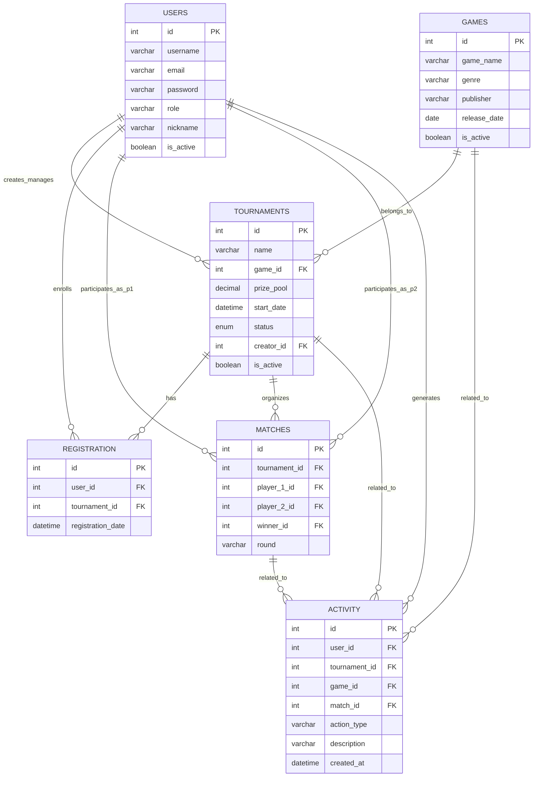

```mermaid
erDiagram
    USERS ||--o{ TOURNAMENTS : "creates_manages"
    USERS ||--o{ REGISTRATION : "enrolls"
    USERS ||--o{ MATCHES : "participates_as_p1"
    USERS ||--o{ MATCHES : "participates_as_p2"
    USERS ||--o{ ACTIVITY : "generates"

    TOURNAMENTS ||--o{ REGISTRATION : "has"
    TOURNAMENTS ||--o{ MATCHES: "organizes"
    TOURNAMENTS ||--o{ ACTIVITY : "related_to"

    GAMES ||--o{ TOURNAMENTS : "belongs_to"
    GAMES ||--o{ ACTIVITY : "related_to"

    MATCHES ||--o{ ACTIVITY : "related_to"

    USERS {
        int id PK
        varchar username
        varchar email
        varchar password
        varchar role
        varchar nickname
        boolean is_active   
    }

    GAMES {
        int id PK
        varchar game_name
        varchar genre
        varchar publisher
        date release_date
        boolean is_active
    }

    TOURNAMENTS {
        int id PK
        varchar name
        int game_id FK
        decimal prize_pool
        datetime start_date
        enum status
        int creator_id FK
        boolean is_active
    }

    REGISTRATION {
        int id PK
        int user_id FK
        int tournament_id FK
        datetime registration_date
    }

    MATCHES {
        int id PK
        int tournament_id FK
        int player_1_id FK
        int player_2_id FK
        int winner_id FK
        varchar round
    }

    ACTIVITY {
        int id PK
        int user_id FK
        int tournament_id FK
        int game_id FK
        int match_id FK
        varchar action_type
        varchar description
        datetime created_at
    }
```