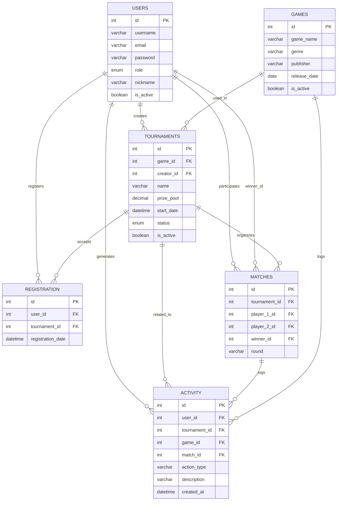

```mermaid
erDiagram
    USERS ||--o{ TOURNAMENTS : creates
    USERS ||--o{ REGISTRATION : registers
    USERS ||--o{ MATCHES : participates
    USERS ||--o{ MATCHES : winner_of
    USERS ||--o{ ACTIVITY : generates

    GAMES ||--o{ TOURNAMENTS : used_in

    TOURNAMENTS ||--o{ REGISTRATION : accepts
    TOURNAMENTS ||--o{ MATCHES : organizes
    TOURNAMENTS ||--o{ ACTIVITY : related_to

    MATCHES ||--o{ ACTIVITY : logs
    GAMES ||--o{ ACTIVITY : logs

    USERS {
        int id PK
        varchar username
        varchar email
        varchar password
        enum role
        varchar nickname
        boolean is_active
    }

    GAMES {
        int id PK
        varchar game_name
        varchar genre
        varchar publisher
        date release_date
        boolean is_active
    }

    TOURNAMENTS {
        int id PK
        int game_id FK
        int creator_id FK
        varchar name
        decimal prize_pool
        datetime start_date
        enum status
        boolean is_active
    }

    REGISTRATION {
        int id PK
        int user_id FK
        int tournament_id FK
        datetime registration_date
    }

    MATCHES {
        int id PK
        int tournament_id FK
        int player_1_id FK
        int player_2_id FK
        int winner_id FK
        varchar round
    }

    ACTIVITY {
        int id PK
        int user_id FK
        int tournament_id FK
        int game_id FK
        int match_id FK
        varchar action_type
        varchar description
        datetime created_at
    }
```
