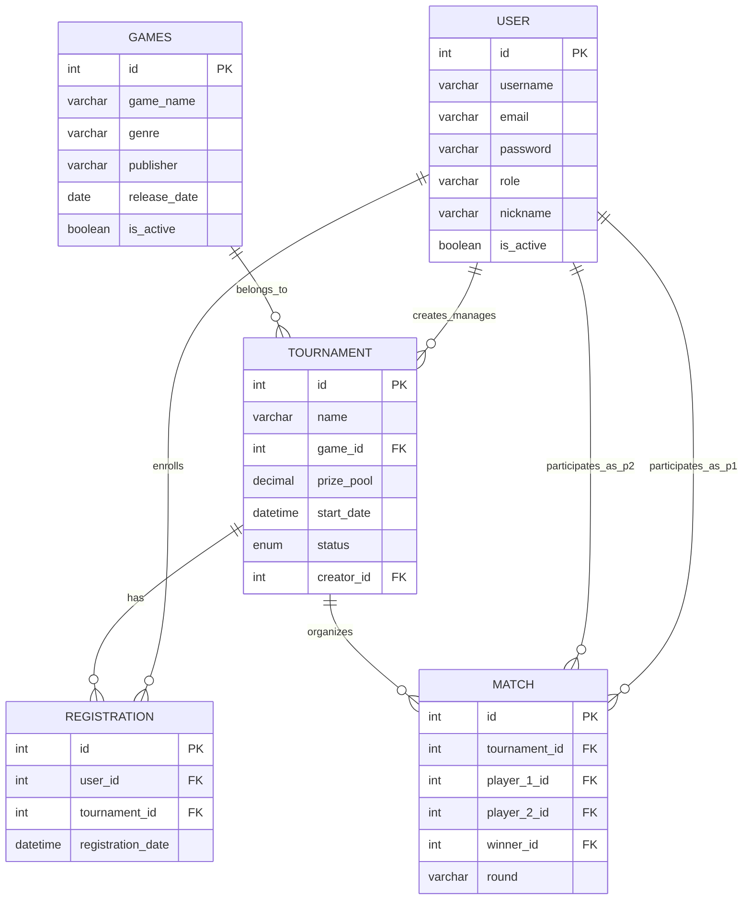

```mermaid
erDiagram
    USER ||--o{ TOURNAMENT : "creates_manages"
    USER ||--o{ REGISTRATION : "enrolls"
    USER ||--o{ MATCH : "participates_as_p1"
    USER ||--o{ MATCH : "participates_as_p2"
    TOURNAMENT ||--o{ REGISTRATION : "has"
    TOURNAMENT ||--o{ MATCH : "organizes"
    GAMES ||--o{ TOURNAMENT : "belongs_to"

    USER {
        int id PK
        varchar username
        varchar email
        varchar password
        varchar role
        varchar nickname
        boolean is_active
    }

    GAMES {
        int id PK
        varchar game_name
        varchar genre
        varchar publisher
        date release_date
        boolean is_active
    }

    TOURNAMENT {
        int id PK
        varchar name
        int game_id FK
        decimal prize_pool
        datetime start_date
        enum status
        int creator_id FK
    }

    REGISTRATION {
        int id PK
        int user_id FK
        int tournament_id FK
        datetime registration_date
    }

    MATCH {
        int id PK
        int tournament_id FK
        int player_1_id FK
        int player_2_id FK
        int winner_id FK
        varchar round
    }
```
